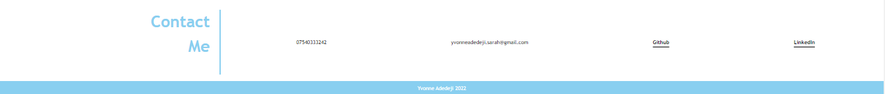

# Yvonne-Portfolio

## Description
Portfolio for Yvonne Adedeji - Front-End Web Developer.
Creation of personal portfolio using HTML and CSS to showcase my up and coming projects. 

> **Note**: All projects within this portfolio are placeholders except Prework Study Guide and the Horiseon code refactor project.

## Prerequisites
N/A

## Criteria
* When the page is loaded the page presents your name, a recent photo or avatar, and links to sections about you, your work, and how to contact you
* When one of the links in the navigation is clicked then the UI scrolls to the corresponding section
* When viewing the section about your work then the section contains titled images of your applications
* When presented with the your first application then that application's image should be larger in size than the others
* When images of the applications are clicked then the user is taken to that deployed application
* When the page is resized or viewed on various screens and devices then the layout is responsive and adapts to my viewport
 
 ## Technologies Used
 Built with:
This portfolio was created using
* HTML
* CSS

## Installation
N/A

## Usage
N/A

## Project Link
Application can can be viewed here: 
* [Live](https://yvonnesarah.github.io/Yvonne-Portfolio/)

* [Repository](https://github.com/yvonnesarah/Yvonne-Portfolio)

## Screenshot(S)
Portfolio - About Me Section

Portfolio - Projects Section

Portfolio - Contact Me Section

## Credit
N/A

## Licence
Please refer to the LICENSE in the repo.

